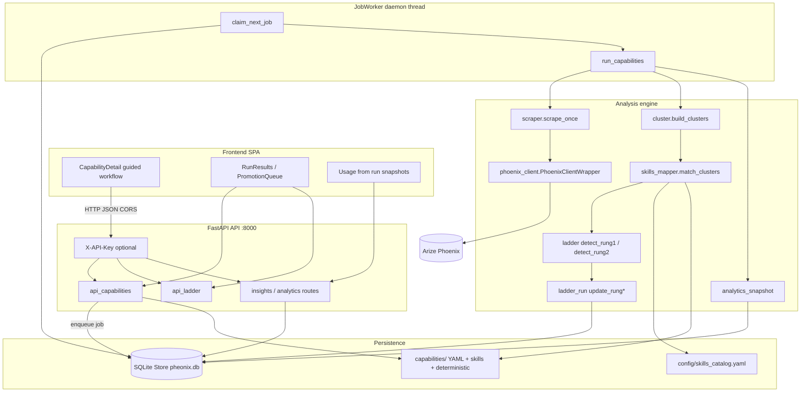

# Architecture

High-level architecture of pheonix (Phoenix Prompt Miner). Implementation lives
in `backend/src/phoenix_scraper/` and `frontend/`.

---

## System context

---

## Components

### UI (React SPA)

- Vite + React 19; absolute API base `VITE_API_BASE` (default `http://localhost:8000`).
- Guided capability detail: Setup → Running → Results → Decide → History.
- Long runs: `POST .../jobs` → `202 {job_id}` → poll every ~1.5s.
- Decide: segregated skill vs deterministic promotion queues.

### API

- FastAPI app (`api.create_app`); `run_jobs=True` starts the worker lifespan.
- Capability CRUD, skill file upload, filter preview, run jobs, run results,
  run compare, analytics-by-run.
- Ladder routes: candidates, decisions, promote / dry-run.
- Optional `PHEONIX_API_KEY` via `X-API-Key`.

### JobWorker

- One daemon thread, one job at a time (`jobs.JobWorker`).
- Claims oldest queued `capability_jobs` row; runs `run_capabilities` for that
  capability id with closed `from` / `to`.
- Progress callbacks update job `stage` / `progress` / `message`.
- Polls ~1s; `notify()` can wake immediately after enqueue (tests cover wake).

### Store / DB

- SQLite (`PHEONIX_DB_PATH`, default `data/pheonix.db`): spans, watermarks,
  capabilities mirror, `capability_runs`, cluster snapshots/members, candidates,
  observations, jobs, analytics snapshots.
- Filesystem remains SoT for `capability.yaml` and skill / deterministic drafts.

### Phoenix scrape client

- Sole live Phoenix I/O: `phoenix_client.PhoenixClientWrapper`.
- Env: `PHOENIX_COLLECTOR_ENDPOINT`, optional `PHOENIX_API_KEY`, TLS via
  `PHEONIX_CA_BUNDLE` / `PHEONIX_TLS_VERIFY`.
- Unavailable → offline analysis of stored spans (run notes mark partial).

### Capability YAML

- Disk: `capabilities/<id>/capability.yaml` (filter, `window_days`, thresholds, status).
- Synced into DB on run / sync endpoints.
- FOBO example: `project: pnl-agent`, `workflow_stage: fobo_recon`.

### Ladder & clustering

- Clustering: normalize + rapidfuzz merge (`cluster`).
- Prompt shape: extract USER QUERY; classify skill vs deterministic (`prompt_shape`).
- Rung 1 / Rung 2 detection + lifecycle (`ladder`, `determinism`, `ladder_run`).
- Artifacts on promote (`artifacts`).

### Analytics snapshots

- Built at end of `run_capability_analysis`; served to Usage for that version’s
  window without rescanning the full span pool.

---

## Process boundaries

| Process | Responsibility |
| --- | --- |
| Vite / browser | UX only |
| API process | HTTP + JobWorker thread + SQLite writer |
| Phoenix | External observability source |

CLI (`pheonix run`, `capability sync`, …) can drive the same engine without the SPA.
