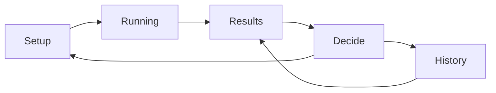

# Business Requirements Document (BRD)

**Product:** pheonix / Phoenix Prompt Miner (`phoenix_scraper`)  
**Audience:** product owners, operators (FOBO first), engineers  
**Status:** Reflects the implemented guided-run + ladder product (post segregation)

---

## 1. Problem

Analyst-facing agents (FOBO reconciliation and similar) answer the same questions
the same way, repeatedly — at LLM cost and latency, with answer variance. Two
transformations recover systematic work:

1. **Prompt → skill:** when many users ask the same thing and no skill covers it,
   the agent re-derives the approach each time. A skill fixes the approach.
2. **Skill/cluster → deterministic:** when answers and tool routes barely change
   across occurrences, the LLM call is ceremony. Deterministic code removes cost,
   latency, and variance.

Operators need a trustworthy loop: pick a closed time window, confirm skill MD
files, run scrape + analysis with visible progress, land on **questions skills
do not cover**, promote frequent gaps to skills, and promote stable LLM routes to
deterministic drafts — without burying decisions under filter/analytics chrome.

---

## 2. Goals

- Treat a **capability** (e.g. FOBO) as a first-class entity with its own filter,
  thresholds, skill directory, and versioned runs.
- Guided operator path: **Setup → Running → Results → Decide → History**.
- Results lead with **skill gaps**; promotion decisions sit beside / after that
  primary column.
- **Segregate** skill (Rung 1) vs deterministic (Rung 2) lanes in Decide so tool /
  SQL / MCP payloads never appear as “promote to skill”.
- Harden scrape reliability: closed `[from, to]` windows, truncation honesty,
  job stage progress.
- Persist **analytics snapshots** per run so Usage unlocks without rescanning the
  corpus.
- Remain **advisory**: detect candidates, track lifecycle, write draft artifacts;
  never sit in the request path.

---

## 3. Users

| Role | Needs |
| --- | --- |
| Capability operator (FOBO) | Closed-window runs, skill MD upload, gap review, accept/reject/snooze, write skill or deterministic drafts |
| Platform engineer | Capability YAML, thresholds, Phoenix TLS/env, job worker health, offline JSONL paths |
| Reviewer / product | Run history, version compare (skill hashes, gaps closed), evidence bars |

Auth is operator `actor` + optional `X-API-Key`. No SSO / multi-tenant identity.

---

## 4. Guided run workflow

Primary surface: capability detail SPA (`frontend/src/routes/CapabilityDetail.tsx`).

| Step | Purpose |
| --- | --- |
| **Setup** | Closed `from` / `to` dates, span filter (project, `workflow_stage`, …), skill MD files list/upload |
| **Running** | `POST /capabilities/{id}/jobs` → poll job until `done` / `error`; stages: scraping → analyzing → matching |
| **Results** | Versioned run (`capability_runs.run_id`): skill gaps first, funnel diagnostics, candidates |
| **Decide** | Promotion queue segregated into **skill lane** and **deterministic lane** (Decide → Write → Done) |
| **History** | Past runs by day; open a version’s Results; compare skill hashes / gaps across versions |

“Run next version” returns to Setup with a required closed window. Analytics /
Usage is secondary and scoped to the version’s window via stored snapshots.

---

## 5. Rung 1 vs Rung 2 segregation

| Lane | Rung | Input shape | Outcome |
| --- | --- | --- | --- |
| **Skill** | Rung 1 | User questions (`is_skill_shaped`) | Propose / strengthen skill MD |
| **Deterministic** | Rung 2 | Tool / SQL / MCP / params (`is_deterministic_shaped`) | Deterministic handler draft |

Backend detection already skips non–skill-shaped clusters for Rung 1
(`ladder.detect_rung1` + `prompt_shape`). The UI (`PromotionQueue`,
`effectiveRung`) re-homes mislabeled skill-rung rows whose titles are clearly
payloads into the deterministic lane so Decide never shows them as promote-to-skill.

FOBO defaults (`capabilities/fobo/capability.yaml`): `filter.project: pnl-agent`,
`workflow_stage: fobo_recon`, demo-friendly ladder thresholds.

---

## 6. Analytics snapshots

After each successful analysis, the run stores an analytics snapshot
(`analytics_snapshot.build_analytics_snapshot`, fallback overview-only). Usage
panels read the snapshot for that `run_id` / window instead of live corpus scans.
Failure to build a full snapshot must not block run completion; overview-only
still unlocks Usage.

---

## 7. Success criteria

- Operator can complete Setup → Run → see skill-gap cards (or a clear funnel empty
  note) without leaving the guided path.
- Closed job windows are enforced (`to > from`); open-ended SPA scrapes are refused.
- Skill uploads with valid YAML frontmatter participate in the next run; hashes are
  recorded on `capability_runs` for version diffs.
- Ready candidates appear in the correct Decide lane; accept → write produces
  drafts under `capabilities/<id>/skills/` or `deterministic/`.
- Truncation and offline scrape paths surface as run notes / partial status, not
  silent empty Results.
- Analytics for a finished run loads from snapshot without a second scrape.

---

## 8. Out of scope

- Serving live traffic or routing requests (advisory tool only).
- LLM / embedding-based clustering or matching (lexical NLP only).
- LLM-as-judge for Rung 2.
- SSO, notifications, multi-Phoenix-instance, distributed job queues.
- Job cancellation / parallel workers.
- Runtime that consumes promoted artifacts (Rung-1-B / Rung-2-B).
- Parallel analysis stack outside existing modules.

---

## 9. Traceability

| Requirement area | Primary code |
| --- | --- |
| Guided UX | `frontend/src/routes/CapabilityDetail.tsx`, `RunResults`, `PromotionQueue` |
| Jobs | `api_capabilities.enqueue_run_job`, `jobs.JobWorker`, `capability_run.run_capabilities` |
| Skills | `capability_skills`, `api_capabilities` skill routes, `skills_mapper` |
| Ladder | `ladder`, `determinism`, `ladder_run`, `artifacts` |
| Scrape / filter | `scraper`, `phoenix_client`, `capability.yaml` + `capability_query_filters` |
| Analytics | `analytics_snapshot`, store `set_analytics_snapshot` |
