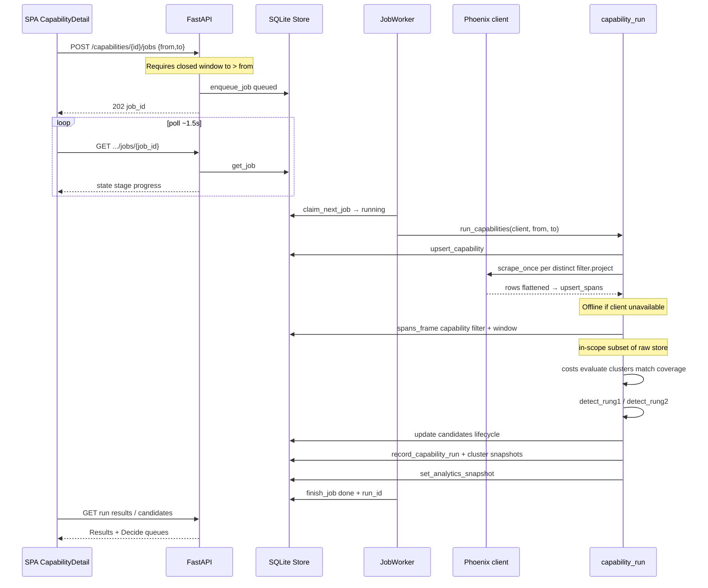
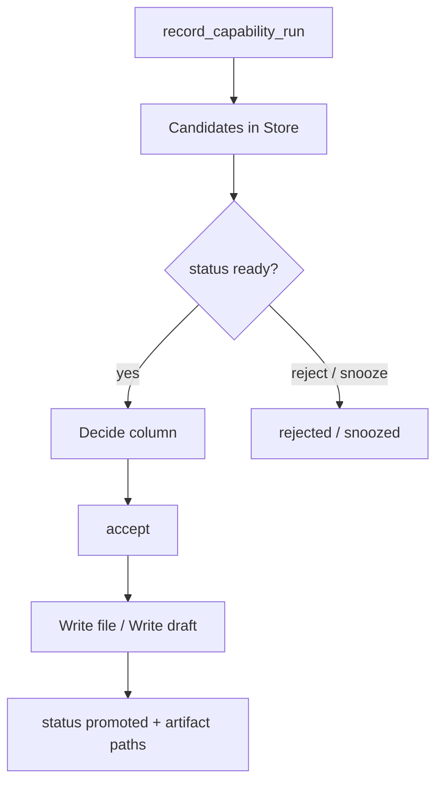
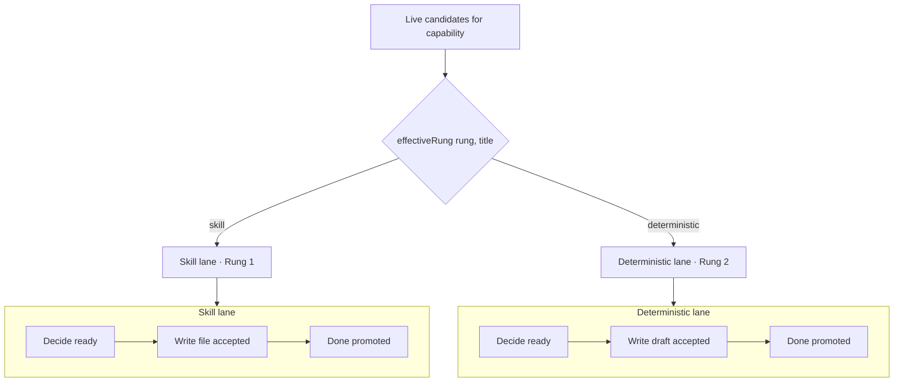
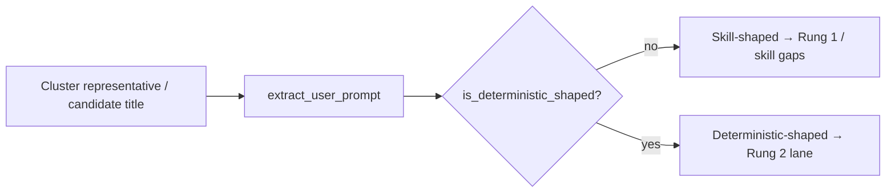

# Flow diagrams

End-to-end capability run flow and Decide lane segregation.

---

## 1. End-to-end run flow

### Stage map (job progress)

| Stage | Approx progress | Work |
| --- | --- | --- |
| `queued` | 0 | Waiting for worker claim |
| `scraping` | ~0.1 | Pull Phoenix (or skip offline) |
| `analyzing` | ~0.45 | In-scope filter, costs, eval, clusters |
| `matching` | ~0.7 | Skills match, coverage, ladder updates |
| `done` / `error` | 1 | Terminal |

### Promotion queue after record

---

## 2. Decide — skill vs deterministic lanes

### Classification inputs

| Signal | Skill lane | Deterministic lane |
| --- | --- | --- |
| Typical text | Natural-language user questions | MCP tool selects, SQL, file_path, param dicts, unextracted Bedrock JSON |
| Detection | `detect_rung1` requires `is_skill_shaped` | `detect_rung2` scores all clusters’ answer stability |
| UI re-home | — | Skill-rung + deterministic title → deterministic lane |
| Promote | `skills/<stem>.md` draft | `deterministic/` Python + notes |

Backend and frontend share the same shape rules (`prompt_shape.py` /
`frontend/src/lib/promptShape.ts`).
