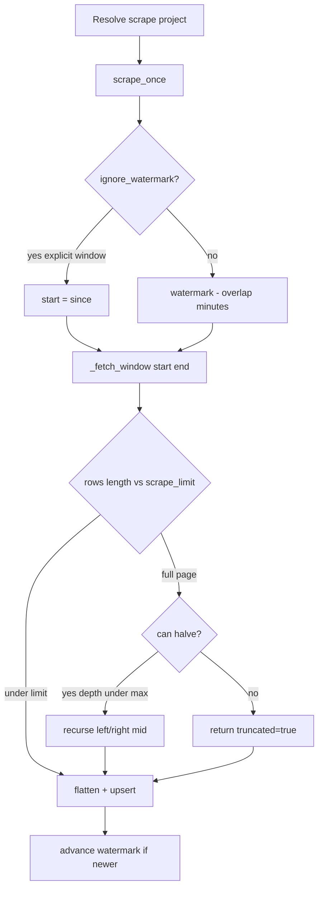

# Span scrape & filter

Accurate behavior from `scraper.py`, `capability_run.py`, `phoenix_client.py`,
and capability filters. Prefer this over older notes that imply open-ended SPA
scrapes or `PHEONIX_PROJECT` as the FOBO scrape source of truth.

---

## 1. Closed window (required for SPA jobs)

`POST /capabilities/{id}/jobs` body (`JobRequest`):

- **`from`** and **`to`** are both required and must be UTC-aware.
- Validation: `to > from` or **422**.

Why closed: Phoenix `get_spans_dataframe` caps at `scrape_limit` with **no cursor**.
`_fetch_window` halves `[start, end]` when a page comes back full. An open end
cannot be halved safely — the pull silently truncates and analysis sees a thin
slice. The SPA always sends absolute dates; `run_capabilities` also defaults
`window_end` to “now” when only a start is supplied (CLI).

When an explicit window is passed, scrape sets `ignore_watermark=True` so a
back-fill can pull older spans. The watermark only ever moves **forward**, so
without `ignore_watermark` an older window is unreachable after the first pull.

---

## 2. Project source of truth: `filter.project` vs `PHEONIX_PROJECT`

```text
scrape project = (capability.filter.project.strip() or settings.project.strip())
```

Implemented in `_scrape_project_for`:

| `filter.project` | Behavior |
| --- | --- |
| Set (FOBO: `pnl-agent`) | **Wins** for scrape **and** in-scope analysis |
| Empty / null | Scrape falls back to `PHEONIX_PROJECT`; analysis uses the filter as written (no project clause → every project already in the store for the window) |
| Both empty | `ValueError` before scrape |

**Do not** leave FOBO on `pnl-agent` in YAML while relying on env alone for the
pull — PATCH / FilterEditor used to wipe unset keys to null and send runs to
`default` / env project with zero in-scope spans. Current PATCH merges
`exclude_unset` filter fields so omitted keys keep the previous project. The SPA
seeds Advanced filter from `capability.filter` (full dump), not a partial summary.

`project_name` in operator copy means this Phoenix project id — the same string
stored on each `SpanRecord.project` at flatten time.

---

## 3. Capability filter → in-scope spans

`capability_query_filters` builds `QueryFilters` from:

- `project`, `workflow_stage`, `asset_class`, `model_name`, `search`, `search_any`
- plus run `window_start` / `window_end`
- `limit=ANALYSIS_SPAN_LIMIT` (**100_000**) for analysis

`run_capability_analysis` does **not** scrape; it reads the store:

```text
n_spans          = store.span_count()          # entire DB
n_in_scope_spans = len(store.spans_frame(filters))  # filter ∩ window
```

Funnel empty notes explain the first stage that hit zero (no in-scope → no
clusters → all covered).

FOBO: `workflow_stage: fobo_recon` (plus project). Stage/asset attributes can be
remapped via `PHEONIX_STAGE_ATTR` / `PHEONIX_ASSET_ATTR` (tried before built-in
keys).

---

## 4. Live scrape pipeline



### Knobs

| Setting | Default | Role |
| --- | --- | --- |
| `PHEONIX_SCRAPE_LIMIT` | 5000 | Page size / full-page detection |
| `PHEONIX_SCRAPE_MAX_SUBDIVISIONS` | 10 | Max halving depth (~1024 slices worst case) |
| `PHEONIX_SCRAPE_OVERLAP_MINUTES` | 15 | Watermark lookback for late spans |
| `PHEONIX_HTTP_TIMEOUT` | 30s | Phoenix read timeout |

Flatten (`flatten_phoenix_row`) requires `span_id`, `trace_id`, `start_time` or
the row is **dropped** (counted separately from duplicates). Truncation appends a
hard warning to capability run notes (`TRUNCATED:…`) and forces attention in the
job finish message.

---

## 5. In-scope vs raw spans

| Term | Meaning |
| --- | --- |
| **Raw / store spans** | All upserted Phoenix (or JSONL) rows in SQLite, any project |
| **Scraped this run** | Rows pulled for the capability’s scrape project(s) in the closed window |
| **In-scope** | Store rows matching capability filter **and** analysis window (capped at 100k) |

A successful scrape that inserts into the wrong project (filter wiped) yields
raw growth and **zero in-scope** — Results funnel notes call that out.

Clusters, matches, ladder, and analytics snapshots are computed on **in-scope**
frames only.

---

## 6. Offline path

If `PhoenixClientWrapper.unavailable_reason()` is set (no endpoint, or
`arize-phoenix-client` missing):

- Scrape is skipped; each project gets a problem note:
  `offline: … — analysed stored spans`.
- Analysis still runs on whatever is already in the DB for the filter/window.
- Notes force capability run `status='partial'` (scrape problems only — info notes
  from a successful scrape do not).

Offline ingest without Phoenix: `scraper.ingest_jsonl` (CLI / tooling) flattens
one JSON object per line into the same store.

Filter **preview** (`POST /capabilities/preview`) never scrapes — it only counts
matching stored spans for a trial filter and window.
