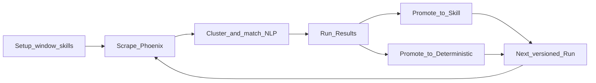

# FOBO Guided Run Workflow — Design

- **Date:** 2026-09-10
- **Status:** Approved (design); phased implementation follows this doc
- **Repo:** `pheonix` — reshapes product UX on top of the existing ladder + async job engine
- **Builds on:**
  - [`2026-09-07-capability-promotion-ladder-design.md`](./2026-09-07-capability-promotion-ladder-design.md)
  - [`2026-09-08-async-capability-runs-design.md`](./2026-09-08-async-capability-runs-design.md)
- **Supersedes:** nothing in the backend engine; **replaces the default SPA path** on capability detail (tab soup → guided Setup → Running → Results)

---

## 1. Summary

The ladder engine already does what operators need for FOBO: closed-window scrape,
prompt clustering, skill match/gaps, determinism suggestions, skill MD upload,
candidates, and async jobs. What is broken is **product shape**. Filters and
analytics dominate; there is no clear “session/version → scrape with status →
results → decide” path; skill-gap review is buried instead of being the main
outcome of a run.

This design keeps and hardens that engine and rebuilds the UI into a **guided
Run workflow** with **versioned run results** as the primary surface. Each **Run
now** creates an immutable **Version** (maps to `capability_runs.run_id`). The
operator path is:

**Setup → Running → Results** (skill gaps first, then promote to skill /
deterministic). Analytics stays secondary and scoped to the version’s window.

No parallel analysis stack. No LLM matching in this phase — lexical NLP remains
the explicit engine.



---

## 2. Problem statement

Operators (FOBO first) want a trustworthy loop:

1. Pick a closed time window and confirm skill MD files.
2. Start a run and **see stages** while scrape/analyze/match work.
3. Land on **questions asked that skills do not cover**, with clear funnel
   diagnostics when counts are zero.
4. Edit/re-upload the same skill filename, re-run, and see gaps shrink across
   versions.
5. Promote frequent uncovered patterns to skills and stable LLM routes to
   deterministic drafts when evidence warrants it.

Today the SPA presents filters, boards, and analytics without directing that
loop. Preview windows can disagree with the operator’s run window. Long scrapes
leave the user on an empty board. Truncation and open-ended first pulls make the
FOBO debug loop unreliable. Analytics is useful for cost/usage but is not the
decision surface.

---

## 3. Goals / non-goals

### Goals

- Reshape UX around **versioned runs** on the existing ladder engine.
- Guided default path: **Setup → Running → Results**.
- Results lead with **skill gaps / updates**; promotion decisions sit beside
  (or immediately after) that primary column; LaneBoard is a decision tool
  inside Results, not the home screen.
- Harden scrape reliability (closed window, truncation honesty, job stage
  progress).
- One aggregated **run results** API so the SPA does not N+1 compose coverage +
  candidates.
- Funnel empty-states that explain which stage dropped to zero.
- Analytics remains available, scoped to **this version’s window**, not required
  to complete the promotion loop.
- All existing ladder / async-job behaviour preserved; new work is additive
  hardening + UX.

### Non-goals (this phase)

- **No parallel analysis stack** — do not reimplement clustering, matching, or
  ladder detection outside the existing modules.
- **No LLM matching** — no embeddings, no LLM-as-judge for paraphrase or Rung 2
  (seam remains for a later phase; already a non-goal in the ladder v1 spec).
- No notifications (Slack/email).
- No SSO / multi-tenant identity beyond existing `actor` + `X-API-Key`.
- No multi-Phoenix-instance support.
- No job cancellation / parallel workers / distributed queue (async design
  constraints stand).
- Runtime that consumes promoted artifacts remains out of scope.

---

## 4. Decisions locked in

| # | Decision |
|---|----------|
| 1 | **Approach** — keep and harden the existing ladder + async job engine; rebuild UI into a guided Run workflow. Do **not** invent a parallel analysis stack. |
| 2 | **Run version is first-class** — each Run now creates an immutable Version (`capability_runs.run_id`) capturing window, skill hashes at start, scrape report, funnel counts, and result payloads. UI label: **Version**. |
| 3 | **Closed windows only in the SPA** — `from` / `to` required; no open-ended first pull. Default: short closed range (e.g. 7 days). 90-day backfill is advanced, with truncation risk messaging. |
| 4 | **Default path** — Setup → Running → Results. Analytics is secondary (“Usage for this version”), not the landing. |
| 5 | **Results priority** — skill gaps first; then Promote to skill (Rung 1) and Promote to deterministic (Rung 2). |
| 6 | **NLP engine** — lexical only this phase: normalize + rapidfuzz clustering; skill match + coverage; determinism lexical score. Tunable thresholds per capability; FOBO defaults biased for interactive iteration (lower creation floor so cards appear earlier; “ready” bar stays evidence-gated). |
| 7 | **Job progress** — extend `capability_jobs` with `stage` + `progress` + `message` so Running never guesses from logs. Stages: `queued → scraping → analyzing → matching → done\|error`. |
| 8 | **Results aggregate API** — `GET /capabilities/{id}/runs/{run_id}/results` composes funnel + uncovered + suggested skill updates + rung1/rung2 candidates for that version. |
| 9 | **Skill validation across versions** — record skill content hashes on the run; next run with the same filenames re-validates; Results can show gaps closed vs new (Phase C). |
| 10 | **Preview honesty** — Filter Preview must use the operator-picked run window, not only saved `window_days`. |
| 11 | **Filter defaults** — project comes from `PHEONIX_PROJECT` unless the operator explicitly narrows; advanced filters stay collapsed on Setup. |

---

## 5. Current state (reuse — do not rebuild)

| Operator ask | Existing piece |
|---|---|
| Scrape spans for from/to | `scraper.py`; jobs via `capability_run.py` |
| Version per run | `capability_runs` + cluster snapshots in `storage.py` |
| Upload skill MD | Skills tab / API in `api_capabilities.py` |
| Same question across users/sessions | `cluster.py` + `normalize.py` |
| Not in skill → flag | `skills_mapper.py`, `skill_coverage.py`, `/skills/uncovered`, `/skills/gaps` |
| LLM repeating → deterministic | Rung 2 in `ladder.py` / `determinism.py` |
| Async scrape/analyze | `jobs.py`, `capability_jobs`, `POST /capabilities/{id}/jobs` |
| Usage/cost analytics | Analytics routes (keep as secondary) |

Design ancestry: capability promotion ladder + async capability runs specs above.

---

## 6. Target product model

### 6.1 Capability (e.g. FOBO)

Owned folder `capabilities/fobo/` with `capability.yaml` + `skills/*.md` (and
`deterministic/` for promoted Rung-2 drafts). Unchanged from the ladder spec.
Filter defaults to **empty** for optional dimensions; project comes from
`PHEONIX_PROJECT` unless the operator explicitly narrows it on Setup
(advanced, collapsed).

### 6.2 Run version (first-class)

Each **Run now** creates an immutable **version** that records:

- `from` / `to` (required in UI)
- skill file set + **content hashes** at run start
- scrape report (pulled / inserted / truncated)
- analysis funnel counts: spans → in-scope → clusters → gaps → rung1 → rung2
- result payloads: uncovered queries, skill update suggestions, rung1/rung2
  candidates

UI labels this as **Version** (maps to `capability_runs.run_id`). A later run
with the same skill filenames re-validates coverage against the new window and
the updated skill bodies.

### 6.3 Guided workflow (default path)

1. **Setup** — pick from/to; upload/confirm skill MD files; optional advanced
   filter (collapsed).
2. **Running** — single progress screen with stages
   `queued → scraping → analyzing → matching → done|error`. Poll existing job
   API (extended with stage/progress/message). Show live notes including
   truncation warnings. Never leave the user on an empty LaneBoard while a job
   is running.
3. **Results** (primary) — three clear columns/sections:
   - **Skill gaps:** clustered questions **not** covered by uploaded skills →
     review → edit MD → re-upload same filename → re-run.
   - **Promote to skill (Rung 1):** frequent uncovered patterns with evidence
     (users/count); wire to existing decision/promote APIs.
   - **Promote to deterministic (Rung 2):** stable LLM reasoning / route → draft
     deterministic artifact via existing promote path.
4. **Analytics** — secondary: volume, cost, users, stages. Scoped to **this
   version’s window**.

---

## 7. Workflow detail

### 7.1 Setup

- Require closed `[from, to]`. Prefill a short default (e.g. last 7 days).
- List skill files already under `capabilities/<id>/skills/`; allow upload /
  replace by filename (existing skills API).
- Show content-hash summary so the operator knows what will be frozen on the
  next Run.
- Advanced filter (project / workflow_stage / asset_class / model / search)
  collapsed; empty optional fields mean “do not narrow.”
- **Preview** (if shown) must query with the same `from`/`to` the operator
  selected — not capability `window_days` alone.
- Primary CTA: **Run now** → `POST /capabilities/{id}/jobs` with `{from, to}`.

### 7.2 Running

- Full-width status view with step indicator: Setup → **Running** → Results.
- Poll `GET /capabilities/{id}/jobs/{job_id}` until `done` or `error`.
- Display `stage`, `progress` (0–1 or percent), and `message`.
- Surface scrape notes (truncation, offline/fallback, partial) as they appear
  in job payload / run notes — do not hide them until Results.
- On `done`, navigate to Results for `run_id`. On `error`, stay on Running with
  the error and a path back to Setup.

### 7.3 Results

- Header: Version id, window, skill hash summary, scrape report, funnel strip.
- **Lead with Skill gaps** (uncovered + suggested updates). Empty state must
  name the funnel stage that hit zero (e.g. “0 in-scope spans”, “0 clusters”,
  “0 gaps — all clusters matched”).
- Promotion sections use existing candidate board semantics inside Results
  (not as the capability home).
- Actions: edit/re-upload skill → **Run next version**; Accept / Promote on
  candidates via existing endpoints.
- Link: “Usage for this version” → Analytics with window locked to this run.

### 7.4 Next version / skill-gap loop

1. Operator edits skill MD (same filename) and re-uploads.
2. New Run with a (possibly new) window freezes new hashes.
3. Phase C: Results compare last vs this version — gaps closed, new gaps,
   deterministic candidates advancing — using skill hashes + coverage /
   `cluster_deltas`.

---

## 8. Data model

### 8.1 Unchanged (reuse)

- `capabilities`, `capability_runs`, `capability_cluster_snapshots`
- `candidates`, `candidate_observations`, `candidate_decisions`
- `capability_jobs` (async design) — **extended** below
- Shared `spans` / scrape watermark / skill scan under capability `skills/`

### 8.2 Extensions

**`capability_jobs`** — add progress fields (names indicative; follow
`storage.py` conventions):

```
stage       TEXT NOT NULL DEFAULT 'queued'
            -- queued | scraping | analyzing | matching | done | error
progress    REAL NOT NULL DEFAULT 0     -- 0.0–1.0
message     TEXT NOT NULL DEFAULT ''   -- operator-visible status line
```

Worker (`jobs.py` / `capability_run.py`) updates these at stage boundaries and
during long scrape pulls. Terminal `state` remains `done` | `error` from the
async design; `stage` mirrors completion (`done` / `error`) when finished.

**`capability_runs`** — record skill snapshot + scrape report (JSON columns
acceptable):

```
skills_hash_json   TEXT NOT NULL DEFAULT '{}'
  -- { "fobo-break-triage.md": "<sha256>", ... } at run start
scrape_report_json TEXT NOT NULL DEFAULT '{}'
  -- { pulled, inserted, truncated, notes... }
funnel_json        TEXT NOT NULL DEFAULT '{}'
  -- { n_spans, n_in_scope, n_clusters, n_gaps, n_rung1, n_rung2 }
```

If some counts already exist as first-class columns on `capability_runs`, keep
them; `funnel_json` (or equivalent) must be enough for the Results strip and
empty-state copy without extra round-trips.

**Skill hashes** are computed from file bytes at run start (capability
`skills/` after sync/upload). Used for Phase C “same filename, new body”
validation and for Results headers.

No new analysis tables. No duplicate cluster/match stores.

---

## 9. API surface

All under the existing protected router (`X-API-Key`). Prefer composing existing
store/coverage/ladder reads over new mining logic.

### 9.1 Job progress (extend existing)

| Method & path | Change |
|---|---|
| `POST /capabilities/{id}/jobs` | Body **requires** closed `from` + `to` from the SPA (CLI may keep optional overrides). Refuse or warn hard when scrape truncates — truncation must appear in job/run payload. |
| `GET /capabilities/{id}/jobs/{job_id}` | Response adds `stage`, `progress`, `message` (plus existing `state`, `run_id`, `error`, timestamps). |
| `GET /capabilities/{id}/jobs` | Include the new fields in list rows. |

### 9.2 Run results aggregate (new)

| Method & path | Purpose |
|---|---|
| `GET /capabilities/{id}/runs/{run_id}/results` | Single payload for the Results screen |

Indicative response shape:

```json
{
  "run_id": "...",
  "capability_id": "fobo",
  "window_start": "...",
  "window_end": "...",
  "skills_hash": { "fobo-break-triage.md": "…" },
  "scrape_report": { "pulled": 0, "inserted": 0, "truncated": false, "notes": [] },
  "funnel": {
    "n_spans": 0,
    "n_in_scope": 0,
    "n_clusters": 0,
    "n_gaps": 0,
    "n_rung1": 0,
    "n_rung2": 0
  },
  "uncovered": [],
  "skill_updates": [],
  "candidates": {
    "skill": [],
    "deterministic": []
  },
  "notes": []
}
```

Compose from existing store + coverage + candidate queries for that
`capability_id` / `run_id`. Do not force the SPA to fan out N endpoints.

### 9.3 Version comparison (Phase C)

| Method & path | Purpose |
|---|---|
| `GET /capabilities/{id}/runs/compare?from_run=&to_run=` | Gaps closed vs new; skill hash diff; candidate status advances between two versions |

May initially lean on `cluster_deltas` / coverage diffs already generalised with
`capability_id`.

### 9.4 Unchanged but wired from Results

- `POST /candidates/{cid}/decision`
- `POST /candidates/{cid}/promote`
- Skill upload / list endpoints under capabilities
- Analytics routes with `?capability=` and explicit `start`/`end` from the
  version window

### 9.5 Filter preview

Any Preview endpoint used on Setup must accept the operator’s `from`/`to` (or
equivalent) and must not silently substitute capability `window_days` alone.

---

## 10. Frontend

**Primary change:** replace the undirected tab layout on
`CapabilityDetail.tsx` with a **wizard + results** layout.

### 10.1 Layout principles

- Full-width pages; clear step indicator: Setup → Running → Results.
- Running is status-first (no empty LaneBoard).
- Results leads with skill gaps / updates; LaneBoard is the decision tool
  inside Results.
- Analytics linked as “Usage for this version,” not the default landing.
- Empty states explain the funnel stage that dropped to zero (reuse
  diagnose-scrape language where it already exists).

### 10.2 Screens

1. **Setup** — window pickers, skill confirm/upload, collapsed advanced
   filters, Preview tied to window, Run now.
2. **Running** — stage machine + progress + messages; poll job; truncation
   warnings inline.
3. **Results** — version header + funnel; Skill gaps; Rung 1; Rung 2;
   deep-link to candidate detail / promote (existing routes OK).
4. **Analytics (secondary)** — existing panels scoped to version window.
5. **Version compare (Phase C)** — last vs this: gaps closed, new gaps,
   deterministic advancing.

Stack, auth gate, and serving model unchanged from the ladder SPA design
(React + Vite + TanStack Query + existing API client).

---

## 11. NLP / matching boundary

### In scope (explicit engine)

- `normalize.py` — `normalize_prompt` / signatures / shared `mask_volatile`
- `cluster.py` — rapidfuzz clustering
- `skills_mapper.py` + `skill_coverage.py` — match, gaps, suggested updates
- `determinism.py` — lexical Rung-2 score
- `ladder.py` — candidate creation + lifecycle (unchanged semantics)

### Improvements this phase (still no LLM)

- Surface **funnel diagnostics** on Results (why 0 clusters / 0 gaps).
- Tunable thresholds per capability (`capability.yaml` / `thresholds_json`) with
  sensible **FOBO defaults for interactive iteration**: lower creation floor so
  cards appear earlier during short windows; the **ready** bar remains
  evidence-gated (sustained runs / min users / min count / determinism bar).
- Document threshold knobs in UI copy where operators hit empty boards.

### Explicitly out of this phase

- Embedding-based clustering or paraphrase matching
- LLM-as-judge for Rung 2 or skill coverage
- Any second matcher that bypasses the modules above

Optional later seam (Phase D / follow-on): embeddings or LLM-assist behind a
flag — already deferred in the ladder spec.

---

## 12. Backend changes (focused)

1. **Scrape reliability** — land closed-window `window_end` pin in
   `capability_run.py`; require closed `[from, to]` from the SPA; refuse or warn
   hard on truncated scrapes in the job/run payload.
2. **Job progress** — extend `capability_jobs` / worker with `stage`,
   `progress`, `message`.
3. **Run results API** — aggregate endpoint in §9.2.
4. **Skill hashes on run** — record at start; feed Results header and Phase C
   compare.
5. **Filter preview honesty** — Preview uses operator window.

No new scraper client; no duplicate pipeline entrypoint beyond the existing
`run_capability_analysis` / job worker path.

---

## 13. Reliability / ops

- Default run window: **closed short range** (e.g. 7 days) until scrape
  subdivision is proven; 90-day backfill is advanced with truncation risk
  messaging.
- Surface `PHEONIX_HTTP_TIMEOUT` / scrape-limit guidance in UI when truncated.
- Keep job work off the request path (already threaded); ensure API `/health`
  stays responsive during long scrapes (verify; fix if worker/store locking
  blocks reads).
- WAL / busy_timeout conventions from the async jobs design remain in force.

---

## 14. Phased delivery

| Phase | Scope |
|---|---|
| **A — Make the loop trustworthy** | Closed-window scrape fix; job `stage`/`progress`/`message`; Results aggregate API; Preview uses run window; funnel empty-states. |
| **B — Guided UI** | Setup → Running → Results wizard; skill-gap-first Results; promote skill / deterministic actions wired to existing ladder APIs; Analytics secondary. |
| **C — Version comparison** | Side-by-side last vs this version (gaps closed after skill re-upload; new gaps; deterministic candidates advancing); skill hash validation across runs. |
| **D — Later (out of this build)** | Embeddings or LLM-assist for paraphrase matching; notifications. |

Phase A can ship behind existing screens; Phase B flips the default path; Phase C
deepens Results without changing the engine.

---

## 15. Success criteria

- Operator can: set from/to → upload FOBO skill MD → start run → watch stages →
  see **questions not covered by skills** when done → edit/re-upload same
  filename → next run shows gaps reduced.
- Same flow surfaces **deterministic** suggestions when LLM answers/routes are
  stable across sessions.
- Analytics remains available for cost/usage but is **not required** to complete
  the promotion loop.
- **No LLM required** for matching in this plan.
- No parallel analysis stack introduced; ladder + async job modules remain the
  sole engine.

---

## 16. Risks / open questions

1. **Short windows vs evidence bar** — interactive FOBO defaults may create
   candidates earlier than `ready`. UI must distinguish “visible for review”
   vs “ready to promote” so operators are not blocked on empty boards or misled
   into promoting thin evidence.
2. **Truncation on large projects** — closed short windows reduce risk but do
   not eliminate it; Results and Running must treat `truncated: true` as a
   first-class warning.
3. **Cluster identity churn** — unchanged from ladder §16; version compare may
   show churn as “new” gaps; accept for this phase.
4. **Health under scrape load** — confirm `/health` and read APIs stay responsive
   with WAL; fix locking if Phase A verification fails.
5. **Preview vs run parity** — any remaining endpoint that still keys only off
   `window_days` is a bug relative to this spec.

---

## 17. Definition of done (this design)

- Spec approved and filed at
  `docs/superpowers/specs/2026-09-10-guided-run-workflow-design.md`.
- Phase A–C implementation plans/PRs track this document’s decisions.
- When Phases A–B land: the default capability path is Setup → Running →
  Results with skill-gap-first outcomes on a versioned run, without LLM matching
  and without a second analysis stack.
